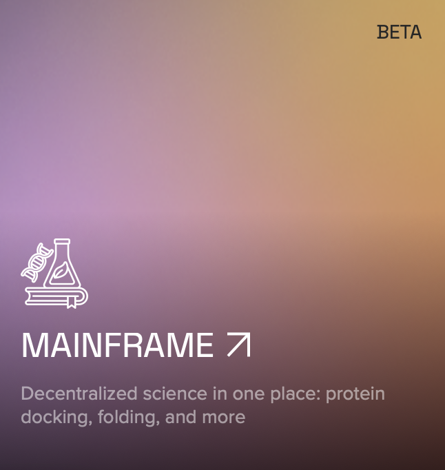

<!-- <div align="center">
    
</div> -->

<picture>
    <source srcset="./assets/macrocosmos-white.png"  media="(prefers-color-scheme: dark)">
    
</picture>

<picture>
    <source srcset="./assets/macrocosmos-black.png"  media="(prefers-color-scheme: light)">
    
</picture>

<div align="center">

</div>


<div align="center">
    
</div>

*inspiration from [owl_posting](https://x.com/owl_posting)*

<div align="center">

# Mainframe

</div>

Subnet 25, Mainframe (formerly known as Protein-Folding) is the first decentralized science subnet on Bittensor. Its focus is on creating DeSci technology for pharmaceutical companies, researchers, and academics. Presently, its focus is on using global computing power to simulate protein molecular dynamics via OpenMM, and protein-ligand docking using DiffDock; both processes essential in most drug discovery pipelines. However, this subnet is designed to be adaptive to a wide array of computing-based problems in the life sciences, utilizing Bittensor’s tokenomics and incentive structure to offer affordable solutions.

Mainframe asks a simple question: can a decentralized, incentivized pool of people be used for generalized scientific compute? At Macrocosmos, we believe it is possible. Not only that, we believe that decentralized and accessible in-silico experimentation is imperative to accelerate science.

"Rational simulation-guided design of atomic systems has been a dream of researchers across the chemical sciences for decades. Enabling rapid and performant experimentation to experts would unlock massive potential to accelerate chemical science" [Mann et al. 2025](https://rowansci.com/publications/egret-1-pretrained-neural-network-potentials)

Mainframe attempts to tackle this very important challenge. 


<div align="center">

<a href="https://app.macrocosmos.ai/mainframe">
  
</a>

👆🏼 enter the mainframe app 👆🏼

</div>

<div align="center">

## Real-World Impact

</div>

✅ Subnet 25 has partnered with Rowan Scientific, an AI-based chemistry software developer. Together, we’re building next generation neural network potential (NNPs) models via specialized DFT data generation on Mainframe. By collaborating, we’re helping create more powerful drug discovery tools for researchers and academics. 

### 🤝 Read more about our collaboration here:
1. [Partnership Announcement](https://www.rowansci.com/blog/partnering-with-macrocosmos?utm_source=substack&utm_medium=email)
2. [Macrocosmos & Rowan in Forbes](https://www.forbes.com/sites/torconstantino/2025/05/14/this-decentralized-ai-could-revolutionize-drug-development/)

### 🧑🏻‍💻 Mainframe App: 
https://app.macrocosmos.ai/mainframe

### 📖 Mainframe Documentation: 
https://docs.macrocosmos.ai/subnets/subnet-25-mainframe 

### 👾 Mainframe’s API: 
https://docs.macrocosmos.ai/developers/api-documentation/sn25-mainframe 


<div align="center">

## Subnet statistics

</div>

This subnet has the following statistics backing it, which show its utility and efficiently:

- 162,200 proteins folded since launch 📈
- Simulation speed of approximately 132,000 nsec/day 🏎️
- Approximately 17 petaflops (20% more than Folding@Home)

<div align="center">

## Core Team

</div>

**Will Squires**, Co-Founder and CEO: Will is an entrepreneur with experience building AI startups. Will has a Master of Engineering degree in civil engineering and sustainability from the University of Warwick.

**Steffen Cruz**, Co-Founder and CTO: Steffen formerly worked at OpenTensor Foundation (the organization behind Bittensor) as their CTO, and is the original architect of Subnet 1, Apex’s codebase. Steffen has a PhD in Experimental Nuclear Physics from the University of British Columbia, Canada.

**Brian McCrindle**, Subnet Lead and Founding Engineer: Brian is the leading subnet designer for Mainframe. Brian formerly worked at OpenTensor Foundation as a Machine Learning Researcher. He has an MASc. in Electrical and Computer Engineering and Computer Vision from McMaster University.

**Syzmon Fonau**, Senior Machine Learning Engineer: Szymon works on expanding and refining subnet 25, making it more robust and functional. He has three years of experience in leadership positions at the Director/C-suite level.

<div align="center">

## Market

</div>

Subnet 25’s product-market-fit is within the following customer groups:

1. Academia: Biochemistry, structural biology, computational chemistry, bioinformatics, or pharmaceutical sciences

2. Governments and non-profit organizations: Institutions or national labs focused on health, biotech, or bioinformatics

3. Small labs and startups: Small to mid-sized biotech startups looking to outsource or speed up early-stage discovery

4. Contract research organizations: Service providers doing research for pharma clients.

5. Pharma and biotech companies: In-house drug discovery teams working on lead identification and optimization

This is because Mainframe offers low-cost solutions that many smaller organizations typically would struggle with access to. This is especially the case when it comes to protein-docking via molecular dynamics, which can be costly due to computing power.

<div align="center">

## Subnet Future Value

</div>

Mainframe is poised to become more valuable as it’s being upgraded into a general purpose life-sciences subnet. Its expansion in Q1 2025 from being purely a protein-folding subnet to a tool that can handle a wide range of unique jobs. 

### Use-cases and potential


Mainframe, has several use-cases:
1. Aid in the drug discovery and design process with its protein-folding and docking toolkit.
Use molecular dynamics to generate potential protein and ligand combinations. that could be used to further academic research at a low cost.

2. Help solve computational problems in the life-sciences sector by offering organizations a global pool of computing resources.

3. Since the pivot in 2025 towards the entire life-sciences domain, Mainframe is able to plug into a range of problems in the scientific world. Its aim is to become one of many tools used by researchers to forward their work, and further help save lives.

4. Mainframe’s first collaboration and partnership with Rowan Scientific is an example of how we can support STEM. By helping provide density-functional-theory (DFT) configurations to their work, we’re actively involved in building greater chemical models.
Dashboards, tools, resources


# License

This repository is licensed under the MIT License.
```text
# The MIT License (MIT)
# Copyright © 2024 Yuma Rao
# Copyright © 2024 Macrocosmos AI

# Permission is hereby granted, free of charge, to any person obtaining a copy of this software and associated
# documentation files (the “Software”), to deal in the Software without restriction, including without limitation
# the rights to use, copy, modify, merge, publish, distribute, sublicense, and/or sell copies of the Software,
# and to permit persons to whom the Software is furnished to do so, subject to the following conditions:

# The above copyright notice and this permission notice shall be included in all copies or substantial portions of
# the Software.

# THE SOFTWARE IS PROVIDED “AS IS”, WITHOUT WARRANTY OF ANY KIND, EXPRESS OR IMPLIED, INCLUDING BUT NOT LIMITED TO
# THE WARRANTIES OF MERCHANTABILITY, FITNESS FOR A PARTICULAR PURPOSE AND NONINFRINGEMENT. IN NO EVENT SHALL
# THE AUTHORS OR COPYRIGHT HOLDERS BE LIABLE FOR ANY CLAIM, DAMAGES OR OTHER LIABILITY, WHETHER IN AN ACTION
# OF CONTRACT, TORT OR OTHERWISE, ARISING FROM, OUT OF OR IN CONNECTION WITH THE SOFTWARE OR THE USE OR OTHER
# DEALINGS IN THE SOFTWARE.
```
