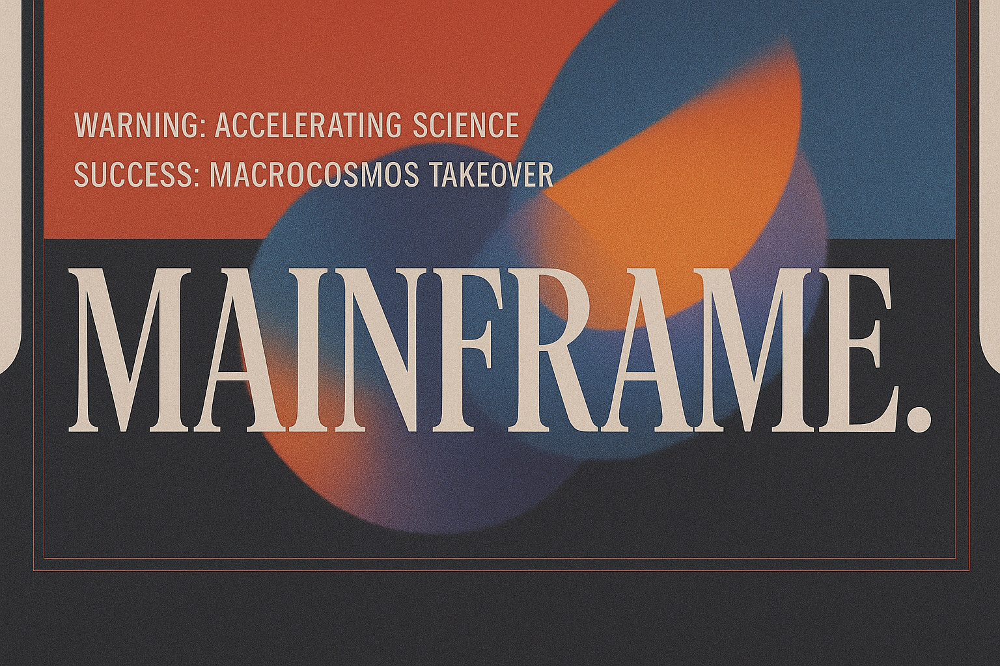

<!-- <div align="center">
    
</div> -->

<picture>
    <source srcset="./assets/macrocosmos-white.png"  media="(prefers-color-scheme: dark)">
    
</picture>

<picture>
    <source srcset="./assets/macrocosmos-black.png"  media="(prefers-color-scheme: light)">
    
</picture>

<div align="center">

</div>


<div align="center">
    
</div>

*inspiration from [owl_posting](https://x.com/owl_posting)*

# The Mission
Mainframe asks a simple question: *could bittensor be used for generalized scientific compute?* We at Macrocosmos believe so. 

"Rational simulation-guided design of atomic systems has been a dream of researchers across the chemical sciences for decades. Enabling rapid and performant experimentation to experts would unlock massive potential to accelerate chemical science" [Mann et al. 2025](https://arxiv.org/abs/2504.20955)

For decentralized science to succeed, we need:
1. Industry/Research collaboration
2. Well defined metrics of success

## Our Principles
- *fast*
- *accurate*
- *scalable*
- *reliable* simulation

## Our Focus
- *molecular dynamics*
- *material propery prediction*
- *model training*

## Our Goals
- academic papers with research groups 
- revenue generating pipelines

## Our Accomplishments (last updated April 30th, 2025)
1. the first desci subnet on bittensor ✅
1. professional and revenue generating collaboration with [Rowan Scientific](https://rowansci.com) to build DTF pipelines on sn25 ✅


# License

This repository is licensed under the MIT License.
```text
# The MIT License (MIT)
# Copyright © 2024 Yuma Rao
# Copyright © 2024 Macrocosmos AI

# Permission is hereby granted, free of charge, to any person obtaining a copy of this software and associated
# documentation files (the “Software”), to deal in the Software without restriction, including without limitation
# the rights to use, copy, modify, merge, publish, distribute, sublicense, and/or sell copies of the Software,
# and to permit persons to whom the Software is furnished to do so, subject to the following conditions:

# The above copyright notice and this permission notice shall be included in all copies or substantial portions of
# the Software.

# THE SOFTWARE IS PROVIDED “AS IS”, WITHOUT WARRANTY OF ANY KIND, EXPRESS OR IMPLIED, INCLUDING BUT NOT LIMITED TO
# THE WARRANTIES OF MERCHANTABILITY, FITNESS FOR A PARTICULAR PURPOSE AND NONINFRINGEMENT. IN NO EVENT SHALL
# THE AUTHORS OR COPYRIGHT HOLDERS BE LIABLE FOR ANY CLAIM, DAMAGES OR OTHER LIABILITY, WHETHER IN AN ACTION
# OF CONTRACT, TORT OR OTHERWISE, ARISING FROM, OUT OF OR IN CONNECTION WITH THE SOFTWARE OR THE USE OR OTHER
# DEALINGS IN THE SOFTWARE.
```
